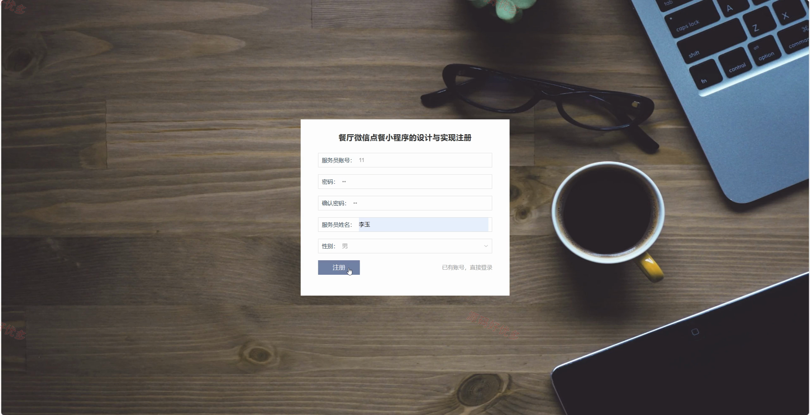
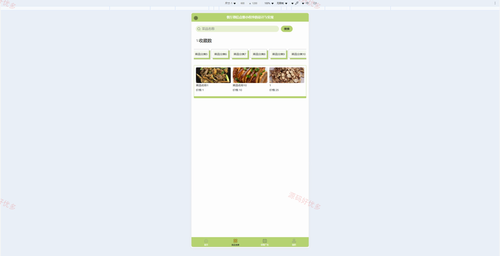
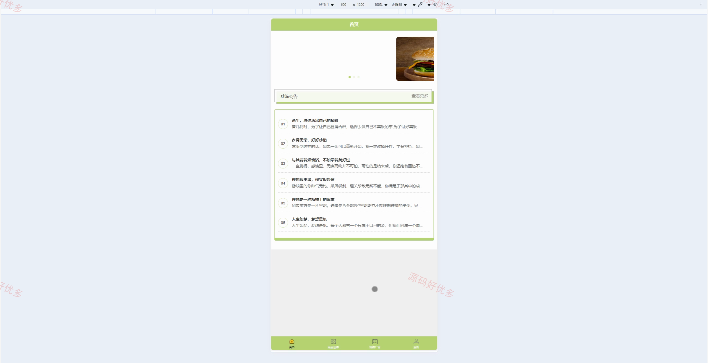
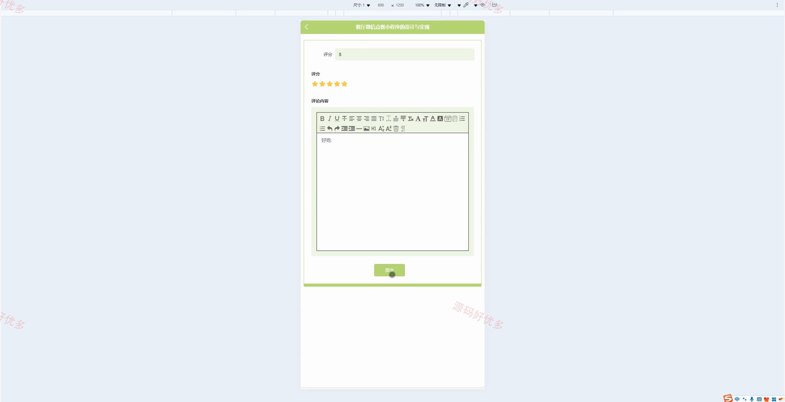
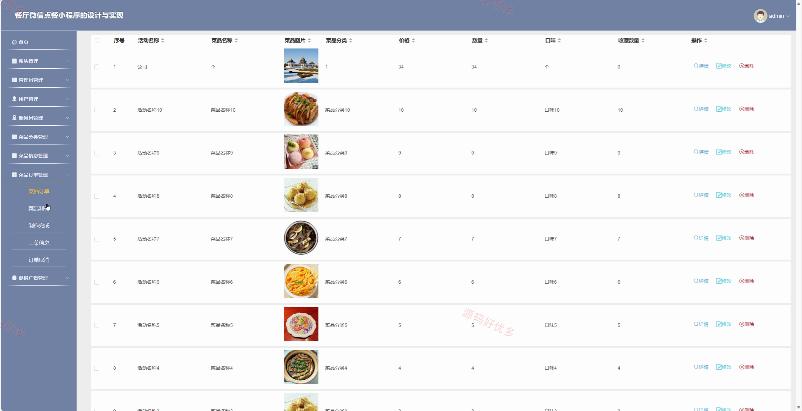
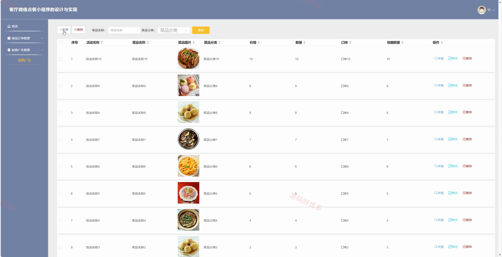
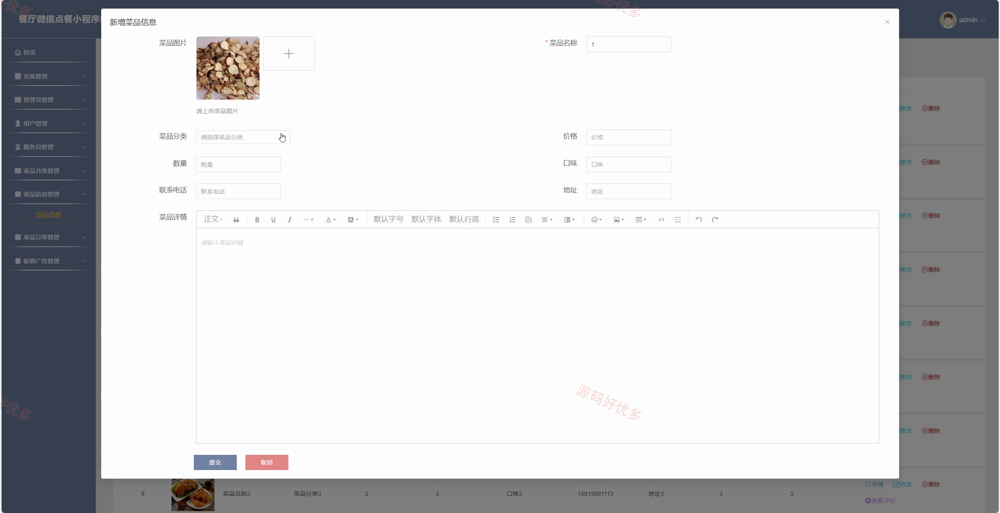
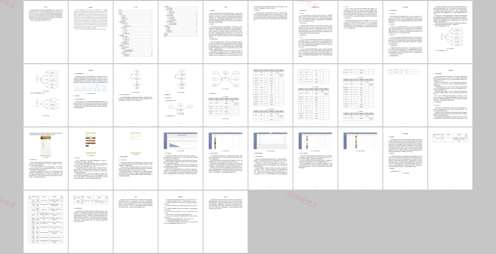

# mpweixinA254D
mpweixinA254Dpy餐厅微信点餐小程序
## 源码问题查看主页咨询

### 一、关键词
微信小程序、餐厅微信点餐小程序、餐厅点餐、菜品订单管理、服务员上菜管理

### 二、作品包含
源码+数据库+万字设计文档+全套环境和工具资源+本地部署教程

### 三、项目技术
前端技术： Html、Css、Js、Vue3.2、Element-Plus、原生微信小程序
后端技术：Python、Django

### 四、运行环境（以下版本亲测，其他版本兼容性请自行测试）
开发工具：PyCharm + VSCODE + 微信开发者工具

数据库：MySQL5.7+（共16张表）

数据库管理工具：Navicat10以上版本

环境配置软件： Python3.8+

前端Nodejs：16+

浏览器：谷歌浏览器

### 五、项目介绍
项目编号：mpweixinA254D

餐厅微信点餐小程序围绕菜品浏览、在线点餐、订单制作、服务员上菜和后台维护等流程建设，用户可在微信端完成点餐与评价，服务员可处理上菜信息，管理员可统一维护菜品、订单、促销公告和基础数据。

角色：管理员、用户、服务员

用户功能：注册登录、菜品浏览、在线点餐、订单支付、收藏评论、个人中心。

管理员功能：用户管理、服务员管理、菜品分类管理、菜品信息管理、菜品订单/制作/上菜管理、促销广告和系统公告管理。

### 六、运行截图

